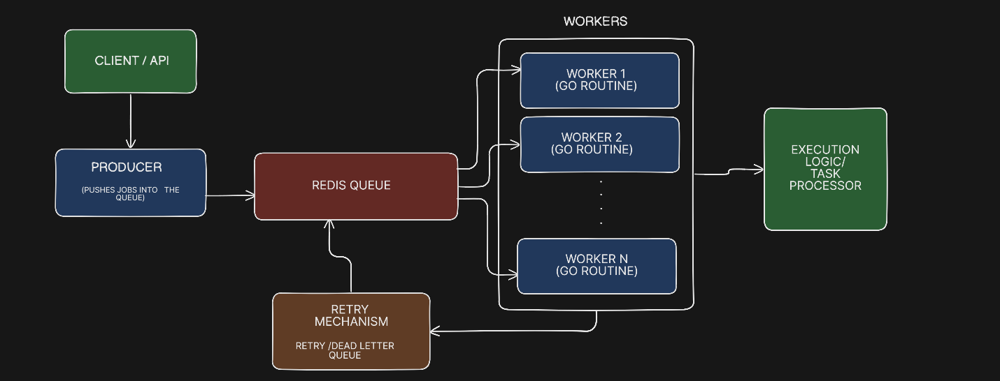

# Go Job Queue

<<<<<<< HEAD
**A fault-tolerant background job queue system built in Go**

This project implements a scalable, reliable job queue system in Go that allows asynchronous background processing of tasks.  
It’s designed to help Go applications process jobs efficiently and recover from failures gracefully.

---

##  Features

Fault tolerance and reliability  
Asynchronous job processing  
Clean Go-idiomatic codebase  
Easy to integrate into other Go projects


*(More advanced features like retries, scheduling, etc. will be added in future versions)*


##  Getting Started
=======
A lightweight, Redis-backed asynchronous job queue built in Go to handle background task processing reliably and concurrently.

This project demonstrates producer-consumer architecture, worker pools using goroutines, retry mechanisms, and clean modular design for scalable backend systems.

# Key Features
Asynchronous background job processing
Redis-backed persistent queue
Concurrent worker pool using goroutines
Configurable worker count
Retry mechanism for failed jobs
Clean modular architecture
Extensible task types

# High Level Overview


# Component Responsibilities
Client / API

Accepts incoming requests and creates job payloads.
Decouples user interaction from background processing.

Producer

Serializes job data into a defined structure.
Pushes jobs into the Redis queue.
Acts as the entry point for asynchronous processing.

Redis Queue

Acts as a persistent message broker.
Stores jobs until consumed by workers.
Enables decoupling between job submission and execution.

Worker Pool

Spawns N goroutines to consume jobs concurrently.
Continuously listens for new jobs from Redis.
Ensures scalable parallel processing.

Task Processor (Execution Logic)

Contains business logic for executing jobs.
Handles actual work (email, payment, computation, etc.).
Keeps infrastructure separate from business code.

Retry / Dead Letter Queue

Handles failed jobs.
Retries jobs up to a defined limit.
Moves permanently failing jobs to a dead-letter queue.


##  To Get Started
>>>>>>> c1fc2c9 (Structure and Component Explanation)

**Prerequisites**

You need Go (1.18+) installed on your system.

Clone the repository:

```bash
git clone https://github.com/VaLTrexx/go-job-queue.git
<<<<<<< HEAD
cd go-job-queue
=======
cd go-job-queue
>>>>>>> c1fc2c9 (Structure and Component Explanation)
